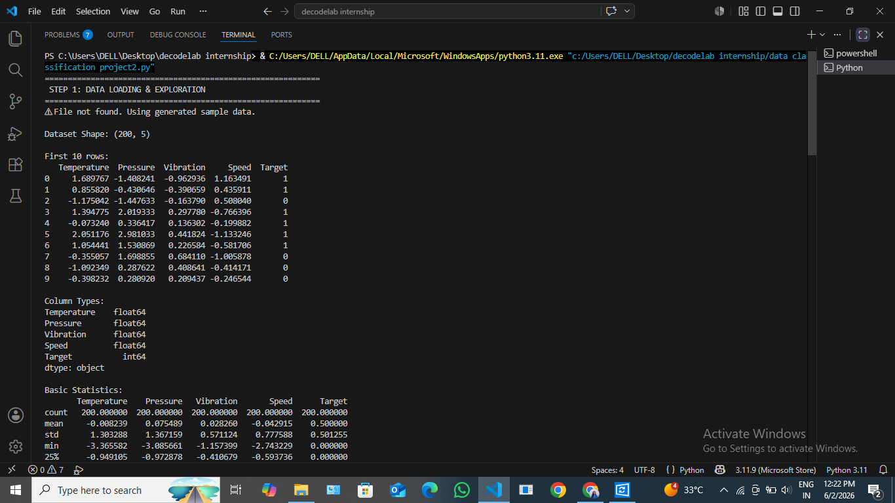
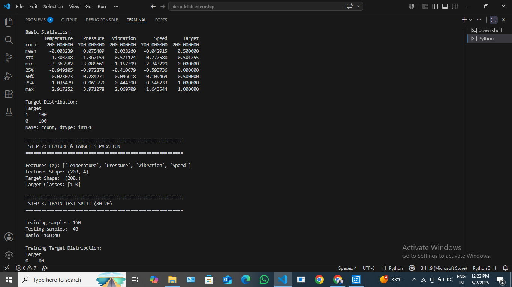
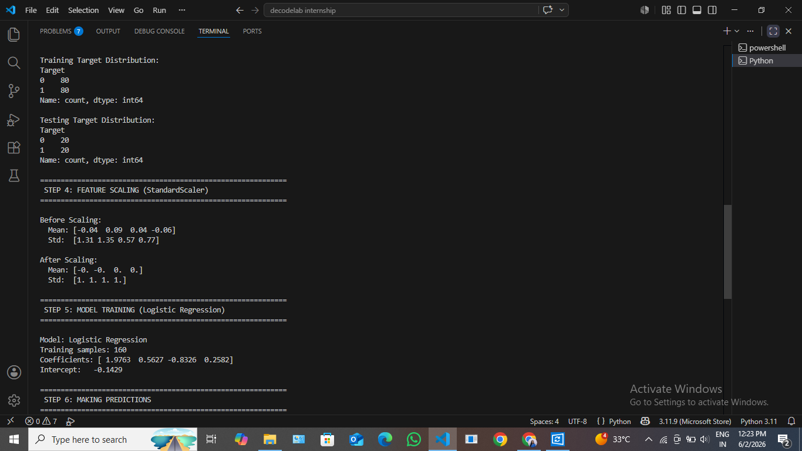
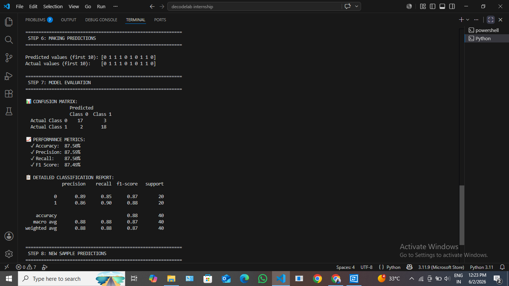
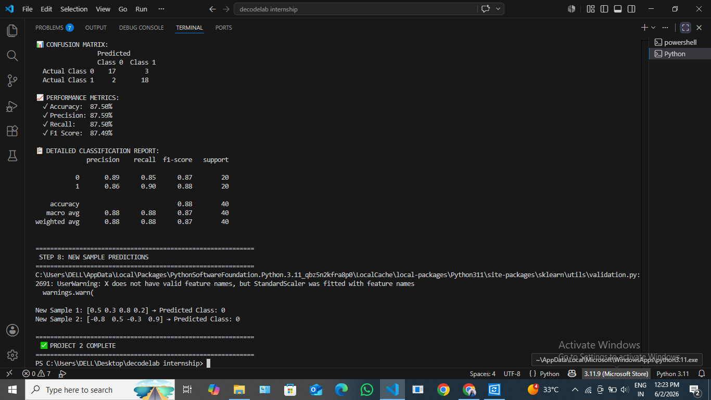

# Data Classification System (Project 2)

A Python-based data classification system designed to process, categorize, and analyze data efficiently based on structured rules and logic criteria.

---

## 🚀 Features
* **Automated Classification:** Smoothly processes input datasets and groups them into distinct categories.
* **Data Cleansing:** Standardizes text inputs (handling casing and whitespace) before applying classification logic.
* **Error Handling:** Safe execution parameters to manage missing or unexpected data values gracefully.

---

## 🛠️ Tech Stack & Concepts
* **Language:** Python 3.x
* **Core Concepts:** Data segmentation, conditional classification rules, string sanitization, and algorithmic logic.

---

## 📦 Installation & Usage
1. **Clone the repository:**
   ```bash
   git clone [https://github.com/soumyabansal75-svg/DecodeLabs-Internship-project2.git](https://github.com/soumyabansal75-svg/DecodeLabs-Internship-project2.git)
   ## 📷 Project Execution Demo

<details>
<summary><b>📐 Click here to expand all 6 execution screenshots</b></summary>

### 1. Initial Dataset & Setup


### 3. Feature and target sepertion and Train-Test split


### 4. Feature scaling and Model Training


### 5. Making predictions and Model Evaluation


### 6. Final Summary & Execution Report


</details>
